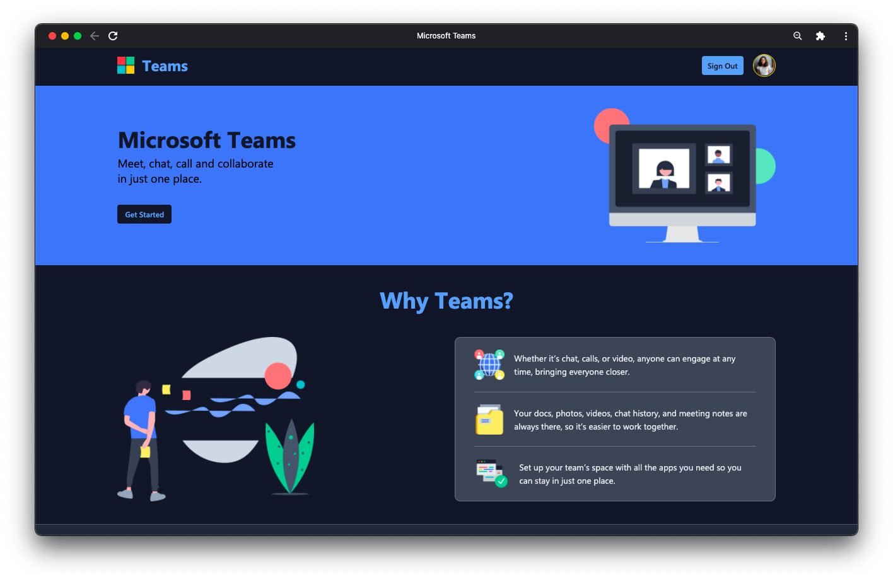
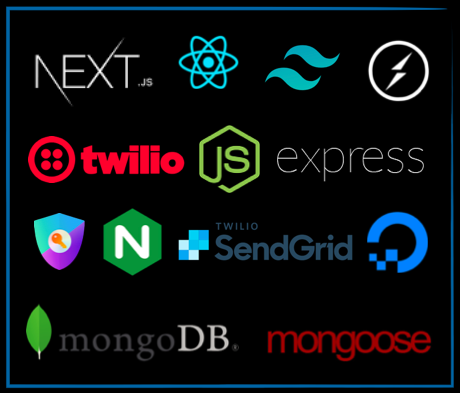
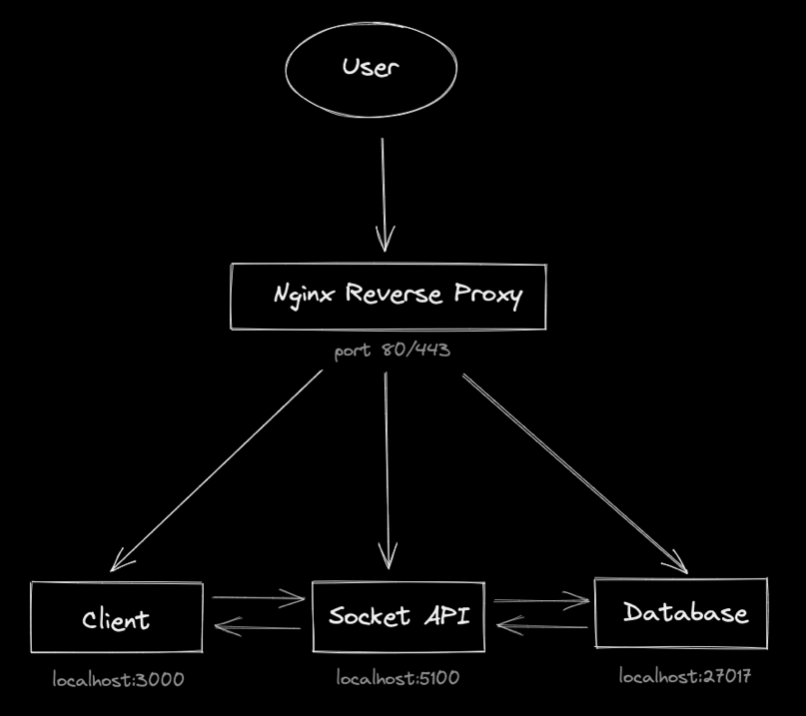

# Teams

[**Teams**](https://msft.lohani.dev) is a web app implementation of Microsoft Teams, the video conferencing and collaboration platform by **Microsoft**.



## Features

1. **Mandatory Feature:** Two-person video call

2. **Surprise Feature:** Chat during, before and after a call

3. **Additional Features:**
   - Call capacity of 25
   - Authentication
   - Screen Share
   - Background Filters (Virtual and Blur) [Only for Chromium-based browsers]
   - Monitoring Network Quality
   - Rooms
   - Named Rooms
   - Toggle user audio
   - Toggle user video
   - Send email invites to users
   - Display list of participants in a call
   - Raise hand
   - Toast notifications
   - Clear chat history
   - Display list of user's recent meetings
   - Fully responsive web app

## Technologies Used



<details>

<summary>
Expand
</summary>

#### Frontend

- React
- Next.js
- Tailwind CSS

#### Video Call and Chat

- Twilio Programmable Video
- Socket.io

#### Backend

- NodeJS
- Express

#### Database

- MongoDB
- Mongoose

#### Other Libraries

- NextAuth.js
- SendGrid
- Twilio Network Quality API
- Twilio Video Processors API

</details>

## Architecture

The client, Socket API and MongoDB database are hosted on a DigitalOcean VPS and available on my domain by reverse proxying the HTTP requests with Nginx.



## Agile Techniques Used

#### Kanban Board

I used a [Kanban board](<(https://github.com/users/ananyalohani/projects/2)>) to organise my tasks by dividing them into 4 categories: **To do**, **In Progress**, **Done** and **Bugs**. I also set an In progress limit of 3, meaning if the In Progress column had 3 tasks, I had to finish them before I move on to start new tasks.

The development of this project was iterative: Design, Code, Redesign, Fix Bugs. I preferred a Kanban board over a Scrum board since I was working a little on each phase throughout the four weeks, and I didn’t see fit to add start and end dates on the sprints.

## API Reference

The network quality of participants in a call can be analysed using Twilio's Network Quality API.

#### Get network quality info for users in a room

```http
GET /api/network-quality?roomId=${roomId}
```

| Parameter | Type     | Description                                                |
| :-------- | :------- | :--------------------------------------------------------- |
| `roomId`  | `string` | **Required**. RoomId for which you want to see the details |

## Development

To run this project locally do the following:

```bash
  # clone this repository and the server submodule
  git clone --recurse-submodules https://github.com/ananyalohani/teams.git
  cd teams

  # if you don't have pnpm installed
  npm i -g pnpm

  # install dependencies
  pnpm i
  pnpm postinstall
```

Make sure that all the environment variables are correctly defined in .env and server/.env file before proceeding to the next step. Refer to [.env.example](.env.example) and [server/.env.example](server/.env.example) for the required environment variables.

```bash
# client runs on port 3000
pnpm client

# server runs on port 5100
pnpm server
```

Go to http://localhost:3000 on your browser.

## Demo

- **Fully Functional Prototype:** https://msft.lohani.dev
- **Presentation:** https://teams-ppt.vercel.app
- **Video Demo:** https://youtu.be/qoQxXQ06DRE

## Credits

- Segoe UI font by Microsoft
- Flat Icons
- Undraw Illustrations
- React Icons

## Contact

**Ananya Lohani**

- Website: [lohani.dev](https://lohani.dev/)
- GitHub: [@ananyalohani](https://github.com/ananyalohani/)
- Email: [ananya@lohani.dev](mailto:ananya@lohani.dev)
